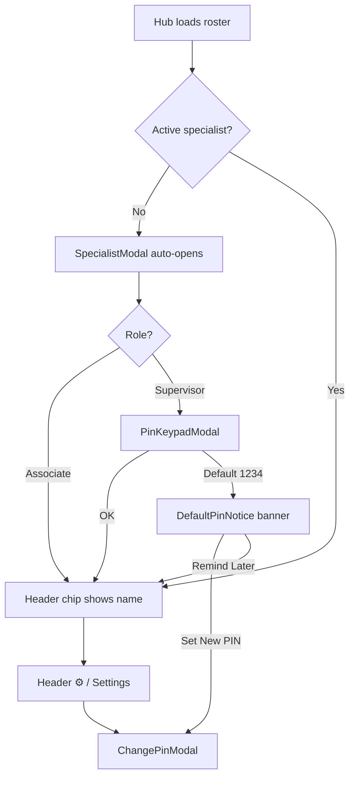
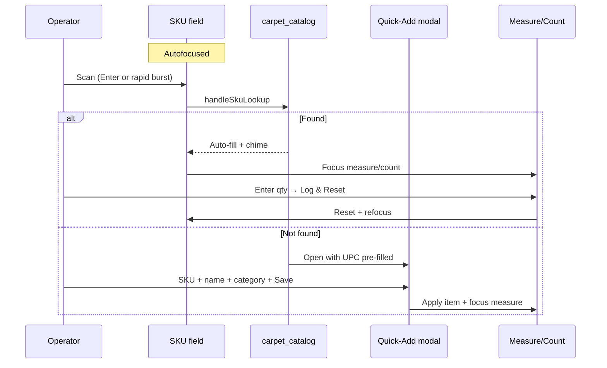

# APP_LAYOUT_MAP — Flooring & SIMS Audit Hub

> Blueprint of the current UI layout, visual structure, and operational flow.
> Purpose: evaluate layout improvements, reduce handheld clutter, and optimize
> the scanning / auditing workflow for floor operators.
>
> Generated from the live codebase (`app/`, `components/`, `lib/types.ts`).
> Last reviewed: 2026-08-17 (bay workflow profiles route Floor SIMS checklists).

---

## Document map

| Section | Contents |
|---------|----------|
| [A. Global shell & header](#a-global-application-shell--header) | Root layout, sticky chrome, network, specialist, nav |
| [B. Primary workspace views](#b-primary-workspace-views--tabs) | Floor · Map · Roster · Settings |
| [C. Overlays & modals](#c-floating-overlays-modals--slide-overs) | Drawers, PIN, Quick-Add, markdown |
| [D. Operational UX analysis](#d-operational-ux--layout-analysis) | Friction, scroll burden, scan path |
| [Appendix](#appendix) | Z-index stack, file index, mermaid flows |

---

## A. Global Application Shell & Header

### A.1 Root layout wrappers

| Layer | File | Role |
|-------|------|------|
| HTML shell | `app/layout.tsx` | Geist + Geist Mono (`--font-geist-sans` / `--font-geist-mono`); PWA meta; `themeColor #090d16`; `viewportFit: cover`; `maximumScale: 1` |
| PWA | `app/manifest.ts` | Standalone, portrait-primary, short_name **DeptSync** |
| Visual base | `app/globals.css` | Dark slate body; emerald radial wash on `#020617`; pin-shake animation |
| Hub page | `app/page.tsx` | Section state, RBAC gate, data load, overlay orchestration |
| SW | `components/hub/ServiceWorkerRegister.tsx` | Registers `public/sw.js` (no visible UI) |

**Viewport composition**

```
┌─────────────────────────────────────┐
│ HubHeader (sticky, z-40)            │  ← title / store # · dept pill · account/PIN
├─────────────────────────────────────┤
│                                     │
│  max-w-lg · hub-main (pb-28)        │  ← keep-alive Floor / Map / Roster / Settings
│                                     │
├─────────────────────────────────────┤
│ BottomNav (fixed, z-30)             │  ← Floor · Map · Roster · Settings
└─────────────────────────────────────┘
     + overlay stack (sheets/modals)
```

- **Default land after login:** `/dashboard` (Floor checklist). Unauthenticated `/` redirects to `/login`. Hub `/` without `?section=` redirects there when signed in. Specialty scans use `/?section=audit|appliances|department`.
- **Primary nav:** exactly four bottom tabs. No header hamburger, More sheet, or Admin Tools drawer.
- **`pb-28` / audit `pb-44`** reserves space for bottom nav (+ sticky Log bar on specialty scans).
- Body scroll locks when the specialist modal or change-PIN modal is open.

**Last reviewed:** 2026-08-15 (role-based views + 3-tap sandbox).

### A.2 Sticky header bar (`NavigationHub`)

**File:** `components/hub/NavigationHub.tsx`  
**Classes:** `sticky top-0 z-40 pt-safe`, content `min-h-12 max-w-lg`

| Slot (L → R) | Content | Action |
|--------------|---------|--------|
| Brand badge | `DeptSyncBadge` (vector boxes + barcode) | Master Admin: 3 taps in 800ms → sandbox |
| Title stack | DeptSync · store # · page title | Display only |
| Department pill | `AdminDepartmentSwitcher` | Switch granted department |
| Account + network | `HeaderNetworkStatus` Wifi / WifiOff + role chip | Opens account/PIN menu |

Master Admin: compact department **dropdown pill** in the header. Close glyphs are `HubIcon id="close"`. No hamburger drawer.

### A.3 Main navigation (`BottomNav`)

**Primary — BottomNav** (`components/hub/BottomNav.tsx`) composed by `NavigationHub`

- Fixed `bottom-0`, `max-w-lg`, `min-h-16` tabs, `pb-safe`, Lucide `NavIcon` stroke 2.
- 2-column grid when CSA (My Shift + Map); 4-column for Master/DS. Active tab: accent top indicator + glow.

| Tab | Route | Meaning |
|-----|-------|---------|
| Floor / My Shift | `/dashboard` | Master/DS: full floor. CSA: assigned bays, packdown, shift goals |
| Map | `/admin/store-map` | Visual navigator (walk / heatmap). Bay CRUD in Settings Topology for Master/DS |
| Roster | `/roster` | Hidden from CSA. DS sees assigned departments; Master sees full store |
| Settings | `/settings` | Hidden from CSA. Master tools + DS targets |

Store Ops pages use `.hub-main` (`px-3 pt-2 pb-28`) so bay lists, status pills, and pace timers clear the fold on handhelds. Quick Touch / filter chips use `.btn-quick-touch` / `.chip-filter` (44px min).

### A.4 Page-level toasts & notices (non-modal)

| Element | Position | When |
|---------|----------|------|
| PIN success toast | Fixed top, z-56 | After PIN change |
| Sync toast | Fixed top, z-56 | Online flush synced ≥1 offline action |
| Default PIN notice | Fixed above bottom nav (`bottom-16`), z-55 | Active specialist still on PIN `1234` |

---

## B. Primary Workspace Views & Tabs

Floor / Map / Roster / Settings keep-alive inside `WorkflowTabShell`. Specialty scans (`/?section=`) stay on hub `/`. Catalog tab is deleted. Remnants live in Settings.

---

### B.1 Cycle & SIMS Audit Engine (`CycleAuditSection`)

**File:** `components/sections/CycleAuditSection.tsx`  
**Route state:** `section === "audit"` (default)

#### Vertical order (handheld)

```
① FIRST VIEWPORT
   Remnant Intelligence chip + Snap Bay chip
   ┌ Roll Measurement Pad ───────────────────┐
   │ live CLF / SQYD in card header          │
   │ SKU scan · details drawer               │
   │ Whole inches · 1/8–7/8 keypad · +5/10/20│
   └─────────────────────────────────────────┘
   sticky Log & Reset (bottom-16, above tabs)

② BELOW FOLD — SUMMARY + LOG
   Collapsed shift summary · Sunday staging
   System On-Hand · Variance · Logging as…
   Supervisor filters · Audit entry cards
```

#### Mode switcher (implicit)

Not a separate tab — **category drives mode** via `auditModeForCategory`:

| Mode | Categories | Primary inputs | Computed |
|------|------------|----------------|----------|
| **A · Rolls** | Carpet, Sheet Vinyl | Inches + fraction + rounds; roll width 12/15 | CLF = in × rounds × 0.2625; live SQFT/SQYD |
| **B · Cartons** | Vinyl Plank, Tile & Stone, Hardwood, Grout & Mortar, Accessories | Box/unit count × sq ft per box | Total sq ft |

Badge on form header: `Mode A · Rolls` / `Mode B · Cartons`.

#### Scan / lookup behavior (layout-critical)

1. SKU field **autofocuses** on mount and after form reset.
2. **Enter** or **rapid ≥8-digit burst** (≤150ms gaps → 250ms debounce) → `handleSkuLookup`.
3. **Match** → fill fields, chime, focus measure/count.
4. **Not found** → **⚡ Quick-Add** modal (barcode pre-filled).

#### CTAs

| Button | Location | Effect |
|--------|----------|--------|
| Copy Shift Summary | Summary card | Clipboard text |
| Export CSV | Summary card | Download CSV |
| + Save to SIMS Catalog | Form (when unmatched typed SKU + name) | Upsert catalog |
| Log Roll/Units & Reset | Sticky bar above bottom nav | Persist audit, clear form, refocus SKU |
| 📍 SIMS Stock | Next to SIMS Location Tag | Opens SimsLocationFinder from Audit |
| Del | Log row | Delete audit |
| Show All / Fewer | Log footer | Expand/collapse list |

#### Nested overlays from this view

- `QuickAddCatalogModal` — unlinked scan  
- `SimsLocationFinder` — 📍 SIMS Stock  
- `PinKeypadModal` — Associate unlocks “Discrepancies only”

---

### B.2 Catalog (deleted)

`CatalogSection` / `ApplianceCatalogSection` / `CatalogItemCard` are unmounted and removed. SKU linking remains via Quick-Add on specialty scan flows. `/catalog` redirects to `/appliances`.

SIMS lookup still lives in `SimsLocationFinder` (opened from Cycle Audit). Quick-Add still lives in `QuickAddCatalogModal`.

---

### B.3 Remnant Rack (`RemnantSection`)

**File:** `components/sections/RemnantSection.tsx`  
**Host:** Settings accordion `#remnants` (not a primary tab)

#### Vertical order

```
① FIRST VIEWPORT
   Status chips: All | Available | Reserved | Sold
   [Search…] [+ Add]

② BELOW FOLD
   Optional long add/edit form
   Remnant cards (dense)
```

#### Aging alerts (`lib/aging.ts`)

| Badge | Condition |
|-------|-----------|
| 🟢 *Nd — New* | 0–29 days |
| 🟡 *Nd — 30+ Days* | 30–59 days |
| 🔴 *Nd — 60+ Days* | 60+ days (also gates markdown CTA for Associates) |

Clearance badge appears when markdown fields are set (`lib/markdown.ts`).

#### Remnant card actions

Mark Reserved · Mark Sold · Edit · Delete ·  
**Apply Manager Markdown** (60+ or Supervisor session)

#### Add/edit form fields

SKU (catalog auto-fill) · Product Name · Category · Tag # ·  
Width (12/15 for roll goods) · Length · live sq ft / sq yd ·  
Estimated value · Location (+ suggestion chips) · Notes · Cancel / Save

#### Nested overlay

- `ApplyMarkdownModal` (+ optional `PinKeypadModal` for non-supervisors)

---

### B.4 Settings & Roster Manager (`SettingsSection`)

**File:** `components/sections/SettingsSection.tsx`  
**Route state:** `section === "settings"`

Stacked cards (~1.5–2 handheld screens):

| Card | Contents |
|------|----------|
| **Profile & Preferences** | Name, role badge, store #; Change PIN; Lucide Palette Appearance & Theme; Device & sync accordion; phone rotation alerts |
| **Department Targets & Sunday Auto-Stage** | Sunday auto-stage (Master); weekly `/wk` quotas; Trigger Weekly Rotation Now |
| **Store Topology & Bay Setup** | Collapsible `AisleBayManager` (add bay, bulk generate, delete) |
| **Catalog & Remnants** | Collapsible taxonomies + remnant inventory / markdown |

**Roster management** lives on the **Roster** tab (`SpecialistCard` + `SpecialistEditSheet`), not Settings: add team member (name, role, home department, optional phone), pair devices via QR.

Floor Pad is no longer a Settings tool. Master/DS open **Walk & Talk** from Floor **Shift Analytics** (`TacticalVoiceFloorPad` inside `ShiftAnalyticsDrawer`); Settings `#manager-notes` redirects to `/dashboard#floor-pad` (expands the drawer).

---

## C. Floating Overlays, Modals & Slide-Overs

| Component | File | Trigger | UI pattern |
|-----------|------|---------|------------|
| **UserPreferencesDrawer** | `hub/UserPreferencesDrawer.tsx` | Header profile + Settings Appearance | Theme, density, contrast, sound, haptics |
| **DevSandboxDrawer** | `hub/DevSandboxDrawer.tsx` | Logo 3-tap (Master) | Preview As Role + Simulate Department |
| **FlagDownstockSheet** | `store-ops/FlagDownstockSheet.tsx` | Floor header Flag Downstock | Aisle/bay search + Needs Top-stock Drop |
| **On-duty person sheet** | `store-ops/OnDutyAssociateStrip.tsx` | Full Store, >6 on duty | Users summary → filter by person |
| **AssociateScheduleModal** | `hub/AssociateScheduleModal.tsx` | Roster manage sheet (embedded) | Sun–Sat day strip + Open/Mid/Close + per-day times |
| **SpecialistEditSheet** | `hub/SpecialistEditSheet.tsx` | Roster card / sliders | Schedule, cross-dept chips, Pair Device via QR, PIN, remove |
| **Pair install card** | `app/pair/page.tsx` | After PIN on `/pair` (iOS / no prompt) | Download / Share / Continue to Floor |
| **AisleBayManager** | `admin/AisleBayManager.tsx` | Settings Store Topology | Add bay, bulk generate, batch delete |
| **EditBayDrawer** | `admin/EditBayDrawer.tsx` | Settings Topology bay Edit | Hotspot / priority lock / 3–21 decay slider |
| **BulkLocationGenerator** | `admin/BulkLocationGenerator.tsx` | Settings Store Topology | Aisle range + Default Velocity Tier seed |
| **TextPromptModal** | `TextPromptModal.tsx` | Reserve remnant; Link barcode | Bottom sheet input |
| **ConfirmModal** | `ConfirmModal.tsx` | Delete remnant | Confirm / cancel sheet |
| **SpecialistModal** | `SpecialistModal.tsx` | Header chip; auto if no specialist | Bottom sheet / dialog; roster + Add Team Member |
| **PinKeypadModal** | `PinKeypadModal.tsx` | Supervisor select; discrepancy filter; markdown gate | 3×4 keypad, z-70 |
| **ChangePinModal** | `ChangePinModal.tsx` | Header ⚙️ / Settings | Current + New + Confirm PIN, z-75 |
| **ChangePinModal** | `ChangePinModal.tsx` | Profile PIN gear | Change 4-digit PIN (AuthWall owns first-login setup) |
| **QuickAddCatalogModal** | `QuickAddCatalogModal.tsx` | Unlinked scan (Audit + Catalog) | Bottom sheet; Save & Continue |
| **SimsLocationFinder** | `SimsLocationFinder.tsx` | Catalog CTA + Audit 📍 SIMS Stock | Search drawer / dialog |
| **ApplyMarkdownModal** | `ApplyMarkdownModal.tsx` | Remnant markdown CTA | % Off / Fixed $ + preview |
| **Quick-AddCatalogModal** | `QuickAddCatalogModal.tsx` | Cycle Audit / scan flows | Link unlinked barcode → catalog (supersedes retired MarryBarcodeModal) |
| **VisualBayScannerModal** | `store-ops/VisualBayScannerModal.tsx` | Floor header **Snap Bay AI Audit** / Store Map CTA / bay sheet / Cycle Audit | Camera or upload → Gemini scan beam → results drawer (z-90) |
| **TacticalVoiceFloorPad** | `dashboard/TacticalVoiceFloorPad.tsx` | Floor Shift Analytics → Walk & Talk | Listening pill + bottom sheet voice/scratchpad + Copilot cards (z-80) |
| **ExecutiveFloorPad** | `manager-notes/ExecutiveFloorPad.tsx` | Floor Pad sheet “full notes” / `#floor-pad` | Full-screen TipTap Floor Pad + Gemini Copilot + archive (z-80) |
| Pin / Sync toasts | `app/page.tsx` | PIN save / online flush | Fixed top status pills |

### Z-index stack

```
30  BottomNav
40  Header
55  DefaultPinNotice (above bottom nav)
56  Toasts
60  Most modals (Specialist, Quick-Add, SIMS Finder, TextPrompt, Confirm, …)
70  PinKeypadModal
75  ChangePinModal, ApplyMarkdownModal
80  Roster sheets (SpecialistEditSheet, Add Team Member)
90  Pair Device QR overlay
```

### Specialist & PIN flow (layout)



---

## D. Operational UX & Layout Analysis

### D.1 What works well for floor scanning

- **Phone-width column** (`max-w-md`) suits handheld / PWA install.
- **SKU autofocus + Enter / rapid-burst lookup** reduces “tap then scan” friction on Audit.
- **Quick-Add** keeps catalog building inside the audit loop (Save & Continue).
- **Large min-h-12 targets** and fraction / ± steppers favor gloves / stubby fingers.
- **Offline badge + queue** visible without leaving the scan workspace.

### D.2 Friction resolved (2026-07-26 layout pass)

| View | Was | Now |
|------|-----|-----|
| **Cycle Audit** | Summary + Log CTA below fold | Collapsed summary; sticky Log & Reset above bottom nav |
| **Section change** | Drawer-only (2 taps) | Bottom tabs only (1 tap) |
| **SIMS lookup** | Catalog-only | Audit 📍 SIMS Stock opens finder |
| **Link barcode / Reserve** | `window.prompt` | `TextPromptModal` |
| **Delete remnant** | `window.confirm` | `ConfirmModal` |

### D.3 Remaining density notes

- **Remnant cards** pack aging + clearance + status + offline + 4–5 action buttons — dense on a 390px-wide screen.
- **Header** packs brand, title, network, specialist, PIN, and menu — readable but tight on small phones when names are long (truncate helps).
- **Remnant / Catalog inline forms** still push lists down while open.
- Unlinked barcode linking uses **Quick-AddCatalogModal** (MarryBarcodeModal retired).

### D.4 Follow-ups

1. ~~Retire or wire `MarryBarcodeModal`~~ — retired (Phase 2).
2. Optional: lift supervisor filters nearer the shift log header without crowding the scan form.
---

## Appendix

### File index (presentation)

```
app/layout.tsx
app/page.tsx
app/pair/page.tsx
app/manifest.ts
app/globals.css
components/hub/HubChrome.tsx          AssociateSpecialtySwitcher only
components/hub/SpecialistModal.tsx
components/hub/PinKeypadModal.tsx
components/hub/ChangePinModal.tsx
components/hub/DefaultPinNotice.tsx
components/hub/ApplyMarkdownModal.tsx
components/hub/TextPromptModal.tsx
components/hub/ConfirmModal.tsx
components/hub/ServiceWorkerRegister.tsx
components/sections/CycleAuditSection.tsx
components/sections/RemnantSection.tsx
components/sections/SettingsSection.tsx
components/barcode/QuickAddCatalogModal.tsx
components/catalog/SimsLocationFinder.tsx
components/ui/NumberField.tsx              NumberField + TextField
```

### High-volume scan path (Audit)



### Shared visual language

- **Surfaces:** `rounded-2xl` / `rounded-xl` cards on `slate-900/90` with `border-slate-800`.
- **Accent:** Emerald CTAs (`bg-emerald-500` / text-emerald) for primary actions.
- **Alerts:** Amber (offline / top stock / PIN), red (delete / shortage), green (match / online).
- **Typography:** UI Geist; Geist Mono `tracking-tight` for bay tags (`A14-B06`), SKUs, cadence badges, timestamps, store eyebrow.
