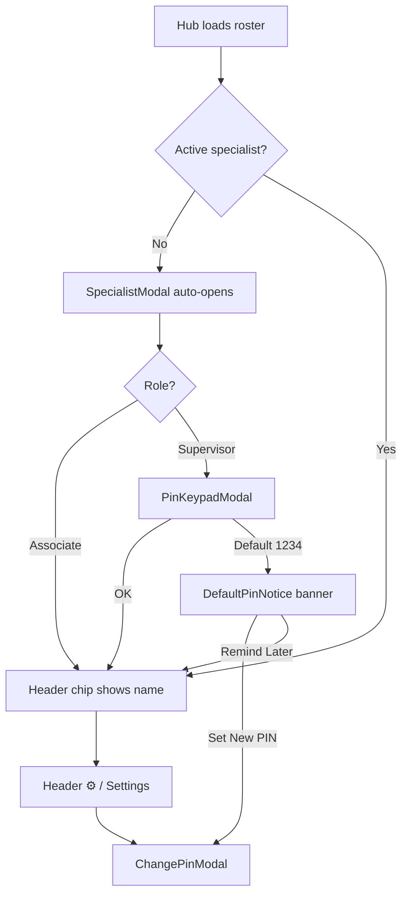
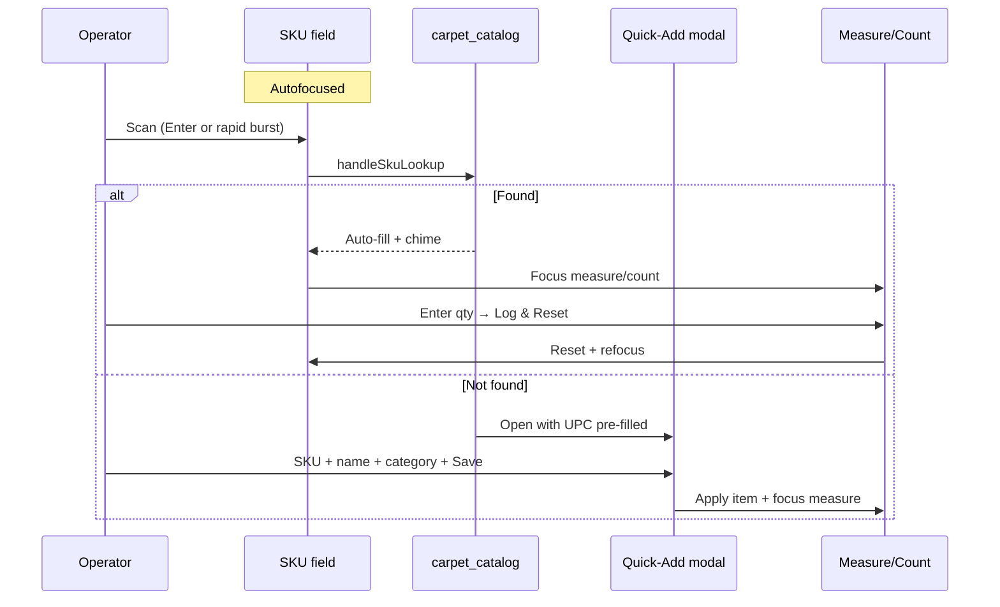

# APP_LAYOUT_MAP — Flooring & SIMS Audit Hub

> Blueprint of the current UI layout, visual structure, and operational flow.
> Purpose: evaluate layout improvements, reduce handheld clutter, and optimize
> the scanning / auditing workflow for floor operators.
>
> Generated from the live codebase (`app/`, `components/`, `lib/types.ts`).
> Last reviewed: 2026-08-14.

---

## Document map

| Section | Contents |
|---------|----------|
| [A. Global shell & header](#a-global-application-shell--header) | Root layout, sticky chrome, network, specialist, nav |
| [B. Primary workspace views](#b-primary-workspace-views--tabs) | Audit · Catalog · Remnants · Settings |
| [C. Overlays & modals](#c-floating-overlays-modals--slide-overs) | Drawers, PIN, Quick-Add, markdown |
| [D. Operational UX analysis](#d-operational-ux--layout-analysis) | Friction, scroll burden, scan path |
| [Appendix](#appendix) | Z-index stack, file index, mermaid flows |

---

## A. Global Application Shell & Header

### A.1 Root layout wrappers

| Layer | File | Role |
|-------|------|------|
| HTML shell | `app/layout.tsx` | Barlow + JetBrains Mono fonts; PWA meta; `themeColor #022c22`; `viewportFit: cover`; `maximumScale: 1` |
| PWA | `app/manifest.ts` | Standalone, portrait-primary, short_name **DeptSync** |
| Visual base | `app/globals.css` | Dark slate body; emerald radial wash on `#020617`; pin-shake animation |
| Hub page | `app/page.tsx` | Section state, RBAC gate, data load, overlay orchestration |
| SW | `components/hub/ServiceWorkerRegister.tsx` | Registers `public/sw.js` (no visible UI) |

**Viewport composition**

```
┌─────────────────────────────────────┐
│ HubHeader (sticky, z-40)            │  ← always visible
├─────────────────────────────────────┤
│                                     │
│  max-w-md · px-4 · py-4 · pb-32     │  ← one active section
│  (audit uses pb-44 for Log bar)     │
│                                     │
├─────────────────────────────────────┤
│ BottomNavBar (fixed, z-30)          │  ← Audit · Catalog · Remnants · Settings
└─────────────────────────────────────┘
     + overlay stack (drawers/modals)
```

- **Default section on load:** `audit` (Cycle Audit).
- **Primary nav:** fixed bottom tab bar — exclusive section switcher (no header hamburger).
- **`pb-32` / audit `pb-44`** reserves space for bottom nav (+ sticky Log bar on Audit).
- Body scroll locks when the specialist modal or change-PIN modal is open.

**Last reviewed:** 2026-08-14 (layout / iconography polish).

### A.2 Sticky header bar (`NavigationHub` primary; `HubChrome` legacy)

**File:** `components/hub/NavigationHub.tsx`  
**Classes:** `sticky top-0 z-40 pt-safe`, content `min-h-12 max-w-lg`

| Slot (L → R) | Content | Action |
|--------------|---------|--------|
| Hamburger | Lucide-free bars in `btn-icon-touch` (48px) | Opens nav drawer |
| Brand badge | `DeptSyncBadge` (vector boxes + barcode) | Display only |
| Title stack | DeptSync · store · page title | Display only |
| Account + network | `HeaderNetworkStatus` Wifi / WifiOff + role chip | Opens account menu |

Master Admin: compact department **dropdown pill** in the header (no second-row tabs). Close glyphs are `HubIcon id="close"`.

### A.3 Main navigation (`BottomNav`)

**Primary — BottomNav** (`components/hub/BottomNav.tsx`) composed by `NavigationHub`

- Fixed `bottom-0`, `max-w-lg`, `min-h-16` tabs, `pb-safe`, Lucide `NavIcon` stroke 2.
- Active tab: accent top indicator + glow.
- Overflow routes live in the More sheet (same 56px row hit area).

| Tab | Route | Meaning |
|-----|-------|---------|
| Floor | `/dashboard` (also `/` audits) | Bay cycle checklist + specialty auditors |
| Map | `/admin/store-map` | Heatmap + bay layout |
| Stock | `/stock` | Downstock queue + remnants |
| Settings | `/settings` | Themes, credentials, Admin Tools |

Store Ops pages use `.hub-main` (`px-3 pt-2 pb-28`) so bay lists, status pills, and pace timers clear the fold on handhelds. Quick Touch / filter chips use `.btn-quick-touch` / `.chip-filter` (44px min).

### A.4 Page-level toasts & notices (non-modal)

| Element | Position | When |
|---------|----------|------|
| PIN success toast | Fixed top, z-56 | After PIN change |
| Sync toast | Fixed top, z-56 | Online flush synced ≥1 offline action |
| Default PIN notice | Fixed above bottom nav (`bottom-16`), z-55 | Active specialist still on PIN `1234` |

---

## B. Primary Workspace Views & Tabs

All four views render inside the shared `max-w-md` column. Only one is mounted at a time.

---

### B.1 Cycle & SIMS Audit Engine (`CycleAuditSection`)

**File:** `components/sections/CycleAuditSection.tsx`  
**Route state:** `section === "audit"` (default)

#### Vertical order (handheld)

```
① FIRST VIEWPORT
   Compact shift summary bar (collapsed by default)
     📊 N Audited | CLF | Cartons  [Expand ▾]
   Optional status flash
   ┌ Scan-to-Catalog form ───────────────────┐
   │ SKU / Barcode  ← autofocus + scan hooks │
   │ Product Name · Category                 │
   │ SIMS Location + [📍 SIMS Stock]         │
   │ Location Type · Measure / Count         │
   └─────────────────────────────────────────┘
   sticky Log & Reset (bottom-16, above tabs)

② BELOW FOLD — FORM TAIL + LOG
   System On-Hand · Variance · Logging as…
   Supervisor filters · Audit entry cards
```

#### Mode switcher (implicit)

Not a separate tab — **category drives mode** via `auditModeForCategory`:

| Mode | Categories | Primary inputs | Computed |
|------|------------|----------------|----------|
| **A · Rolls** | Carpet, Sheet Vinyl | Inches + fraction + rounds; roll width 12/15 | CLF = in × rounds × 0.2625; live SQFT/SQYD |
| **B · Cartons** | Vinyl Plank, Tile & Stone, Hardwood, Grout & Mortar, Accessories | Box/unit count × sq ft per box | Total sq ft |

Badge on form header: `Mode A · Rolls` / `Mode B · Cartons`.

#### Scan / lookup behavior (layout-critical)

1. SKU field **autofocuses** on mount and after form reset.
2. **Enter** or **rapid ≥8-digit burst** (≤150ms gaps → 250ms debounce) → `handleSkuLookup`.
3. **Match** → fill fields, chime, focus measure/count.
4. **Not found** → **⚡ Quick-Add** modal (barcode pre-filled).

#### CTAs

| Button | Location | Effect |
|--------|----------|--------|
| Copy Shift Summary | Summary card | Clipboard text |
| Export CSV | Summary card | Download CSV |
| + Save to SIMS Catalog | Form (when unmatched typed SKU + name) | Upsert catalog |
| Log Roll/Units & Reset | Sticky bar above bottom nav | Persist audit, clear form, refocus SKU |
| 📍 SIMS Stock | Next to SIMS Location Tag | Opens SimsLocationFinder from Audit |
| Del | Log row | Delete audit |
| Show All / Fewer | Log footer | Expand/collapse list |

#### Nested overlays from this view

- `QuickAddCatalogModal` — unlinked scan  
- `SimsLocationFinder` — 📍 SIMS Stock  
- `PinKeypadModal` — Associate unlocks “Discrepancies only”

---

### B.2 Catalog & SIMS Location Finder (`CatalogSection`)

**File:** `components/sections/CatalogSection.tsx`  
**Route state:** `section === "catalog"`

#### Vertical order

```
① FIRST VIEWPORT
   [📍 SIMS Location Finder]   ← opens drawer modal
   [Search SKU/barcode/tag…] [+ Add]

② BELOW FOLD
   Optional inline Add/Edit form card
   Catalog item cards (filtered list)
```

#### Catalog search / filter bar

- Free-text + digit scan (`TextField` with `onScanCommit`).
- Filters in-memory by SKU, name, vendor, category, SIMS tag, UPC.
- Unlinked scan → Quick-Add modal.

#### Item card hierarchy

```
SKU · category chip · 🏷️ Barcode Linked?
Product name
Vendor · width or sqft/box · Offline?
📍 default SIMS location
UPC …
[Edit] [Remove]
[Link Barcode | Unlink Barcode]
```

#### Inline add/edit form fields

SKU · Product Name · Category · Default SIMS Location · Vendor ·  
Roll Width **12/15** (roll goods) **or** Sq Ft/box · UPC · Cancel / Save

#### SIMS Location Finder drawer

**File:** `components/catalog/SimsLocationFinder.tsx`

- Full-height bottom sheet / centered dialog.
- Search by SKU, barcode, or SIMS tag.
- Result cards: SKU, Sales Floor / Top Stock pill, SIMS tag, cumulative CLF / sq ft / units, audit count, “Catalog default” chip.

#### ⚡ Quick-Add to SIMS Catalog modal

**File:** `components/barcode/QuickAddCatalogModal.tsx`  
Shared with Audit.

| Field | Notes |
|-------|-------|
| UPC banner | Pre-filled scanned barcode (read-only display) |
| Lowe's Item # / SKU | Required |
| Product Description | Required |
| Category | Dropdown (`FLOORING_CATEGORIES`) |
| Default SIMS Location | Free text |
| Roll Width 12/15 **or** Sq Ft/box | Depends on category mode |
| **Save & Continue Audit** | Writes `carpet_catalog`, applies to current form |
| Cancel | Closes; Audit refocuses SKU |

---

### B.3 Remnant Rack & Clearance Hub (`RemnantSection`)

**File:** `components/sections/RemnantSection.tsx`  
**Route state:** `section === "remnants"`

#### Vertical order

```
① FIRST VIEWPORT
   Status chips: All | Available | Reserved | Sold
   [Search…] [+ Add]

② BELOW FOLD
   Optional long add/edit form
   Remnant cards (dense)
```

#### Aging alerts (`lib/aging.ts`)

| Badge | Condition |
|-------|-----------|
| 🟢 *Nd — New* | 0–29 days |
| 🟡 *Nd — 30+ Days* | 30–59 days |
| 🔴 *Nd — 60+ Days* | 60+ days (also gates markdown CTA for Associates) |

Clearance badge appears when markdown fields are set (`lib/markdown.ts`).

#### Remnant card actions

Mark Reserved · Mark Sold · Edit · Delete ·  
**Apply Manager Markdown** (60+ or Supervisor session)

#### Add/edit form fields

SKU (catalog auto-fill) · Product Name · Category · Tag # ·  
Width (12/15 for roll goods) · Length · live sq ft / sq yd ·  
Estimated value · Location (+ suggestion chips) · Notes · Cancel / Save

#### Nested overlay

- `ApplyMarkdownModal` (+ optional `PinKeypadModal` for non-supervisors)

---

### B.4 Settings & Roster Manager (`SettingsSection`)

**File:** `components/sections/SettingsSection.tsx`  
**Route state:** `section === "settings"`

Stacked cards (~1.5–2 handheld screens):

| Card | Contents |
|------|----------|
| **Store number / location** | Active `Lowe's #n`; numeric input (500ms debounce auto-save → full data reload) |
| **Security & PIN** | Signed-in name; **⚙️ Change My PIN**; note for Associates about discrepancy PIN |
| **Offline sync queue** | Pending count; **Replay queue now** |
| **Supabase** | Configured? · URL · **Test connection** |
| **Local storage** | Offline audit / catalog / remnant counts + in-memory loaded counts |

**Roster management** lives primarily in **SpecialistModal** (header), not as a Settings sub-page: add team member (name, Associate/Supervisor, optional/required PIN), select active specialist.

---

## C. Floating Overlays, Modals & Slide-Overs

| Component | File | Trigger | UI pattern |
|-----------|------|---------|------------|
| **BottomNavBar** | `HubChrome.tsx` | Always | Fixed bottom tabs (exclusive section nav) |
| **TextPromptModal** | `TextPromptModal.tsx` | Reserve remnant; Link barcode | Bottom sheet input |
| **ConfirmModal** | `ConfirmModal.tsx` | Delete remnant | Confirm / cancel sheet |
| **SpecialistModal** | `SpecialistModal.tsx` | Header chip; auto if no specialist | Bottom sheet / dialog; roster + Add Team Member |
| **PinKeypadModal** | `PinKeypadModal.tsx` | Supervisor select; discrepancy filter; markdown gate | 3×4 keypad, z-70 |
| **ChangePinModal** | `ChangePinModal.tsx` | Header ⚙️ / Settings | Current + New + Confirm PIN, z-75 |
| **ChangePinModal** | `ChangePinModal.tsx` | Profile PIN gear | Change 4-digit PIN (AuthWall owns first-login setup) |
| **QuickAddCatalogModal** | `QuickAddCatalogModal.tsx` | Unlinked scan (Audit + Catalog) | Bottom sheet; Save & Continue |
| **SimsLocationFinder** | `SimsLocationFinder.tsx` | Catalog CTA + Audit 📍 SIMS Stock | Search drawer / dialog |
| **ApplyMarkdownModal** | `ApplyMarkdownModal.tsx` | Remnant markdown CTA | % Off / Fixed $ + preview |
| **Quick-AddCatalogModal** | `QuickAddCatalogModal.tsx` | Cycle Audit / scan flows | Link unlinked barcode → catalog (supersedes retired MarryBarcodeModal) |
| **VisualBayScannerModal** | `store-ops/VisualBayScannerModal.tsx` | Store Map CTA / bay sheet / Cycle Audit **📷 Snap Bay AI Audit** | Camera or upload → Gemini scan beam → results drawer (z-90) |
| **ExecutiveFloorPad** | `manager-notes/ExecutiveFloorPad.tsx` | Admin Tools / `/manager-notes` / `#manager-notes` | Full-screen TipTap Floor Pad + Gemini Copilot + archive (z-80) |
| Pin / Sync toasts | `app/page.tsx` | PIN save / online flush | Fixed top status pills |

### Z-index stack

```
30  BottomNavBar
40  Header
55  DefaultPinNotice (above bottom nav)
56  Toasts
60  Most modals (Specialist, Quick-Add, SIMS Finder, TextPrompt, Confirm, …)
70  PinKeypadModal
75  ChangePinModal, ApplyMarkdownModal
```

### Specialist & PIN flow (layout)



---

## D. Operational UX & Layout Analysis

### D.1 What works well for floor scanning

- **Phone-width column** (`max-w-md`) suits handheld / PWA install.
- **SKU autofocus + Enter / rapid-burst lookup** reduces “tap then scan” friction on Audit.
- **Quick-Add** keeps catalog building inside the audit loop (Save & Continue).
- **Large min-h-12 targets** and fraction / ± steppers favor gloves / stubby fingers.
- **Offline badge + queue** visible without leaving the scan workspace.

### D.2 Friction resolved (2026-07-26 layout pass)

| View | Was | Now |
|------|-----|-----|
| **Cycle Audit** | Summary + Log CTA below fold | Collapsed summary; sticky Log & Reset above bottom nav |
| **Section change** | Drawer-only (2 taps) | Bottom tabs only (1 tap) |
| **SIMS lookup** | Catalog-only | Audit 📍 SIMS Stock opens finder |
| **Link barcode / Reserve** | `window.prompt` | `TextPromptModal` |
| **Delete remnant** | `window.confirm` | `ConfirmModal` |

### D.3 Remaining density notes

- **Remnant cards** pack aging + clearance + status + offline + 4–5 action buttons — dense on a 390px-wide screen.
- **Header** packs brand, title, network, specialist, PIN, and menu — readable but tight on small phones when names are long (truncate helps).
- **Remnant / Catalog inline forms** still push lists down while open.
- Unlinked barcode linking uses **Quick-AddCatalogModal** (MarryBarcodeModal retired).

### D.4 Follow-ups

1. ~~Retire or wire `MarryBarcodeModal`~~ — retired (Phase 2).
2. Optional: lift supervisor filters nearer the shift log header without crowding the scan form.
---

## Appendix

### File index (presentation)

```
app/layout.tsx
app/page.tsx
app/manifest.ts
app/globals.css
components/hub/HubChrome.tsx          HubHeader + BottomNavBar
components/hub/SpecialistModal.tsx
components/hub/PinKeypadModal.tsx
components/hub/ChangePinModal.tsx
components/hub/DefaultPinNotice.tsx
components/hub/ApplyMarkdownModal.tsx
components/hub/TextPromptModal.tsx
components/hub/ConfirmModal.tsx
components/hub/ServiceWorkerRegister.tsx
components/sections/CycleAuditSection.tsx
components/sections/CatalogSection.tsx
components/sections/RemnantSection.tsx
components/sections/SettingsSection.tsx
components/barcode/QuickAddCatalogModal.tsx
components/catalog/SimsLocationFinder.tsx
components/ui/NumberField.tsx              NumberField + TextField
```

### High-volume scan path (Audit)



### Shared visual language

- **Surfaces:** `rounded-2xl` / `rounded-xl` cards on `slate-900/90` with `border-slate-800`.
- **Accent:** Emerald CTAs (`bg-emerald-500` / text-emerald) for primary actions.
- **Alerts:** Amber (offline / top stock / PIN), red (delete / shortage), green (match / online).
- **Typography:** UI Barlow; mono JetBrains for SKUs, CLF, barcodes, store eyebrow.
